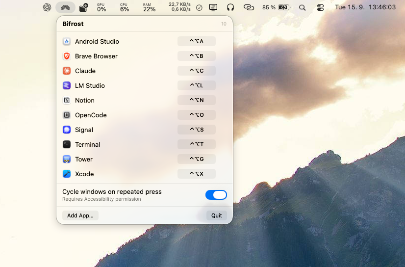

<p align="center">
  
</p>

<h1 align="center">Bifrost</h1>

<p align="center">Global hotkeys for your macOS apps, from the menu bar.</p>

<p align="center">
  
  
  
</p>

---

Press a shortcut, get your app. Bifrost focuses it if it's open, launches it if
it isn't, and can step through its windows if you press again.

## Features

- **Any app, any shortcut** — add from `/Applications`, record a combination
- **Launch or focus** — one key does both
- **Window cycling** — press again to move through an app's windows
- **Out of the way** — menu bar only, no Dock icon, no main window
- **No permission for shortcuts** — only the optional window cycling asks for Accessibility
- **No dependencies** — system frameworks only

## Install

Requires macOS 14 or later.

Download `Bifrost.dmg` from the [latest release](https://github.com/adam-leitgeb/bifrost-macos/releases/latest),
open it, and drag Bifrost into Applications. Builds are signed and notarized by
Apple, so it opens without a Gatekeeper warning.

To build from source instead, with Xcode installed:

```sh
git clone https://github.com/adam-leitgeb/bifrost-macos.git
cd bifrost-macos
./Scripts/build-app.sh
open build/Bifrost.app
```

## Usage

1. Click the rainbow icon in the menu bar
2. **Add App…**, then pick one or more apps
3. Click **Record** and press your combination

Finder is always in the list, so it can get a shortcut without being added.

Shortcuts apply immediately and come back on the next launch. Escape cancels a
recording, Delete clears a shortcut. Hovering a row shows a button that clears its
shortcut, then turns into a trash button that removes the app. Every shortcut
needs at least one of ⌘ ⌥ ⌃, so ordinary typing is never captured.

### Window cycling

Turn on **Cycle windows on repeated press** at the bottom of the menu. Press an
app's shortcut again while it is already frontmost and Bifrost moves to the next
window — handy for two browser windows, or several Xcode projects.

macOS asks for Accessibility access the first time you switch it on. That is the
only way to reach another app's individual windows, and it's the only part of
Bifrost that needs a permission.

## Docs

- [How it works](docs/how-it-works.md) — architecture and the APIs behind it
- [Building](docs/building.md) — toolchain, signing, troubleshooting
- [Releasing](docs/releasing.md) — tagging, notarization, required secrets

## License

[MIT](LICENSE) — use it, change it, sell it. No warranty.
